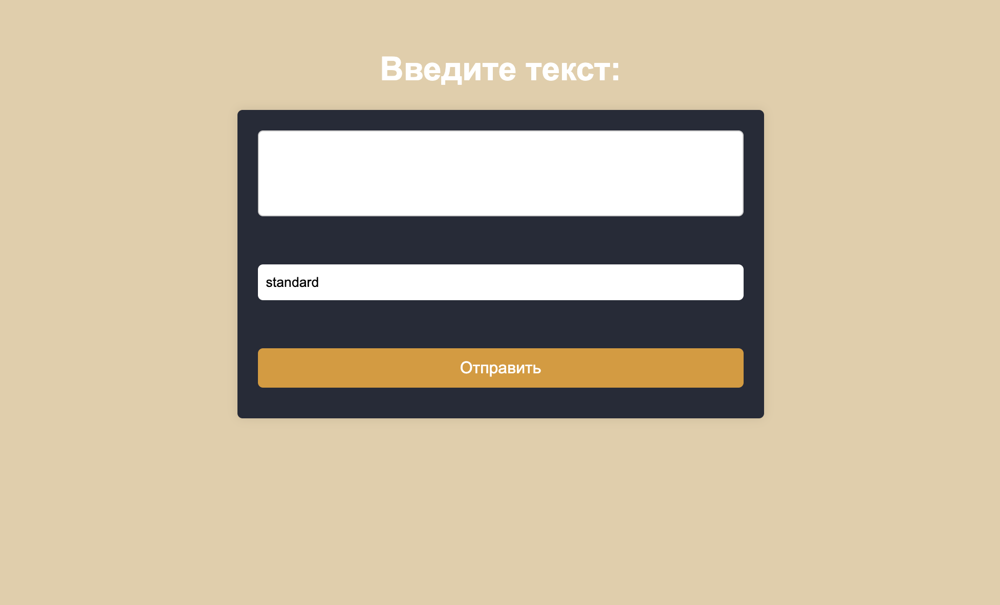

# ascii-art-web

### Objectives

Ascii-art-web consists in creating and running a server, in which it will be possible to use a web GUI (graphical user interface) version of your last project, ascii-art.

Your webpage must allow the use of the different banners:

* shadow
* standard
* thinkertoy

Implement the following HTTP endpoints:

1. GET /: Sends HTML response, the main page.
1.1. GET Tip: go templates to receive and display data from the server.

2. POST /ascii-art: that sends data to Go server (text and a banner)
2.1. POST Tip: use form and other types of tags to make the post request.\

The way you display the result from the POST is up to you. What we recommend are one of the following :

* Display the result in the route /ascii-art after the POST is completed. So going from the home page to another page.
* Or display the result of the POST in the home page. This way appending the results in the home page.

The main page must have:

* text input
* radio buttons, select object or anything else to switch between banners
* button, which sends a POST request to '/ascii-art' and outputs the result on the page.

### HTTP status code

Your endpoints must return appropriate HTTP status codes.

OK (200), if everything went without errors.
Not Found, if nothing is found, for example templates or banners.
Bad Request, for incorrect requests.
Internal Server Error, for unhandled errors.
In the root project directory create a README.MD file with the following sections and contents:

Description
Authors
Usage: how to run
Implementation details: algorithm

### Instructions
1. go run . 
2. broser => localhost:2030

### Preview

## Command
###  @agalimov
### @dyermagam
### @sshangit